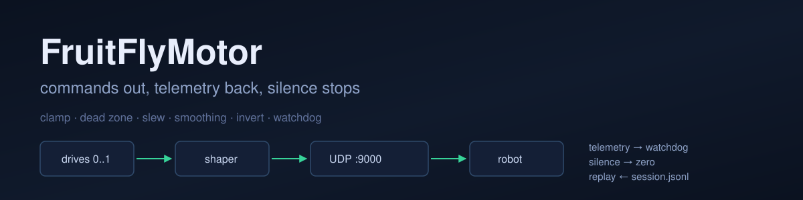
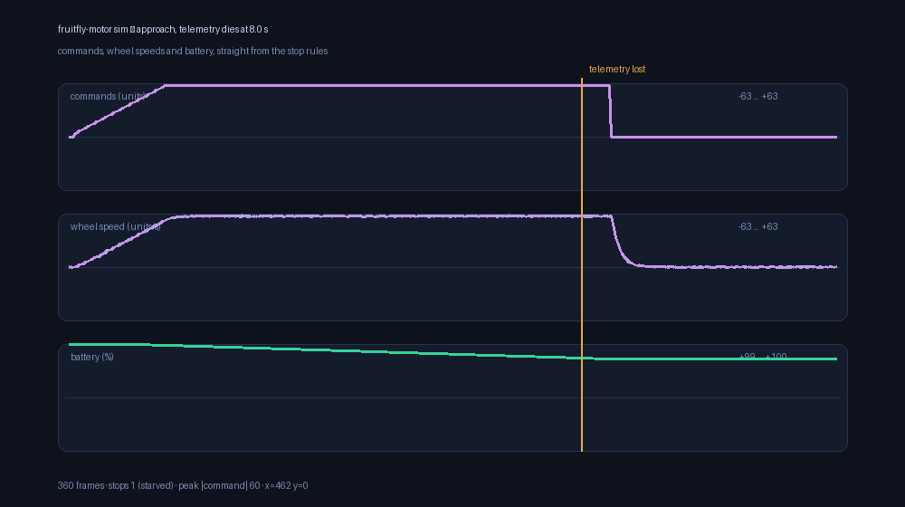

<div align="center">



# FruitFlyMotor

**The last hop: shaped commands out, telemetry back, silence treated as a stop.**


[](LICENSE)


[Quick start](#quick-start) · [Stop rules](#the-two-stop-rules) · [Simulator](#simulator) · [Limitations](#current-limitations)

</div>

This is the actuator side of the [fruitfly-brain](https://github.com/fruitflyxyz/fruitfly-brain)
bridge, extracted so it can be shaped, simulated and replayed without a camera. It
takes two drives in 0..1 — exactly what the bridge's decoder produces — turns them
into motor commands a microcontroller will accept, puts them on the wire, and treats
a quiet link as an instruction to stop.

No dependencies outside the standard library, on purpose. This is the code between a
computer and a motor, and every package it does not import is one fewer thing to
install on a bench machine that is already having a bad day.

**Thirty seconds, no hardware, no robot:**

```bash
git clone https://github.com/fruitflyxyz/fruitfly-motor.git
cd fruitfly-motor
python3.11 -m venv .venv && . .venv/bin/activate
pip install -e ".[dev]"
fruitfly-motor check
fruitfly-motor sim --seconds 8 --silence-after 5
```

The second command is the whole story: the robot walks, the telemetry dies at 5 s,
and the commands go to zero.

## What it does

- **Shapes drives in a fixed order**: clamp → dead zone → slew limit → smoothing →
  per-side invert. The order is fixed because each step is only correct before the
  next one applies — the dead zone belongs before the slew limiter, or a slow ramp
  through 3 units starts moving a robot that was told to stand still.
- **Speaks strict JSON/UDP** in both directions: every packet validated, sequences
  gated, rejects counted. A malformed packet is never partially applied, because half
  a motor command is a direction nobody asked for.
- **Stops on silence, twice over**: the shaper zeroes the wire command when the loop
  goes quiet, and the watchdog reports *why* — `never-fed` and `starved` are different
  problems with the same symptom.
- **Simulates the robot**: first-order wheel lag, differential yaw with a damped
  rate, battery drain, seeded noise. Same seed, same run.
- **Benches the link**: UDP round trip with p50/p99 command age on the loopback.
- **Replays sessions** recorded by `sim` through a real shaper, at recorded speed or
  flat out.

## Architecture

`drives → Shaper → UDP :9000 → robot`

`robot → telemetry → Watchdog → (stop rule) → Shaper`

Every time value in this package is a parameter, never a `sleep` — which is why the
suite runs in under a second, and why a replay can run in two seconds flat or hold
its recorded pace with one flag. Details in [docs/ARCHITECTURE.md](docs/ARCHITECTURE.md),
measured behaviour in [docs/VALIDATION.md](docs/VALIDATION.md).

## Quick start

```bash
fruitfly-motor check                     # protocol, shaper, watchdog: self-test
fruitfly-motor sim --seconds 8           # a healthy run
fruitfly-motor sim --seconds 8 --silence-after 5   # watch the stop rules fire
fruitfly-motor bench --count 200         # UDP round trip, p50/p99
```

`check` needs nothing. `sim` needs the plant model. `bench` needs two sockets on one
machine. `replay` needs a session file, and `send` needs a robot.

## The two stop rules

A quiet link must end in a stopped robot, and there is more than one way for a link
to go quiet:

- **The shaper's own timeout** zeroes the command if nothing updated it for
  `timeout_ms` (500 ms by default). This protects against a hung caller.
- **The watchdog** tracks telemetry age and names the failure: `never-fed` means
  nothing ever arrived — check the address; `starved` means it used to arrive and
  stopped — check the process, the cable, the robot.
- In the firmware scaffold (which lives in the [fruitfly-brain](https://github.com/fruitflyxyz/fruitfly-brain)
  repository) the board stops itself when commands go quiet. A Python process that
  hangs cannot send the packet that says "stop", so the last rule lives on the board.

`sim --silence-after N` demonstrates all of it: watch the trace, then read the
counter. The measured numbers are in [docs/VALIDATION.md](docs/VALIDATION.md).

## Simulator



*Rendered by `examples/sim_demo.py` from the real shaper, the real plant model and
the real stop rules.*

```bash
fruitfly-motor sim --profile square --seconds 12 --csv run.csv
fruitfly-motor sim --profile startle --seconds 3      # escape path, no camera needed
fruitfly-motor sim --seconds 10 --record session.jsonl
python examples/sim_demo.py                           # re-render the trace above
```

Five profiles ship with the package: `approach`, `square`, `wiggle`, `idle` and
`startle` (which fires the escape command after standing still, so the escape path is
covered by the simulator and the test suite).

## Talking to a robot

```bash
fruitfly-motor send --left 20 --right 20 --target 127.0.0.1:9000
fruitfly-motor replay --session session.jsonl --target 127.0.0.1:9000 --realtime
```

The default target is `127.0.0.1:9000`, which is where the bridge's example
configuration points. There is no authentication — see [SECURITY.md](SECURITY.md) for
what that implies on a bench network.

## Repository structure

```text
assets/                    Banner and the rendered session trace
src/fruitfly_motor/        Protocol, shaper, watchdog, transport, sim, replay, CLI
examples/sim_demo.py       Runs a session and renders the PNG above
tests/                     88 checks: protocol, shaper, watchdog, transport, sim, replay, CLI
docs/                      Architecture and validation notes
.github/workflows/test.yml Ruff + pytest on 3.11 and 3.12
```

## Current limitations

- **No hardware validation.** Everything here has run against the plant model and
  UDP on the loopback. No motor has turned.
- **The plant model is a demonstrator.** First-order lag with noise, not physics.
  Its job is to make the stop rules observable, not to predict a real chassis.
- **UDP without authentication.** Any host on the bench network can send commands.
  There is a sequence gate on telemetry and nothing else.
- **Replay timing is best-effort.** `--realtime` uses `sleep` and does not correct for
  drift on a busy machine; the flat-out mode is exact and occasionally useful for
  finding a firmware bug that only shows up under back-to-back packets.
- **One robot per process.** The transport is a single socket with a single target.

## Roadmap

- [x] Protocol, shaper, watchdog, UDP transport, CLI
- [x] Plant model, profiles, replay
- [x] Session trace rendered from the live stack
- [ ] Bench-validate the firmware scaffold on a real board
- [ ] Compare the plant model against a recorded run of the real chassis
- [ ] Serial framing for boards without WiFi

## Family

This repository is one of three that share an interface:

- [fruitfly-brain](https://github.com/fruitflyxyz/fruitfly-brain) — the bridge in the
  middle, with the firmware scaffold
- [fruitfly-vision](https://github.com/fruitflyxyz/fruitfly-vision) — the encoder
  side, standalone, with calibration and packet export

They are separate packages on purpose: you can swap either end for your own and keep
the JSON in the middle.

## License

MIT — see [LICENSE](LICENSE).
